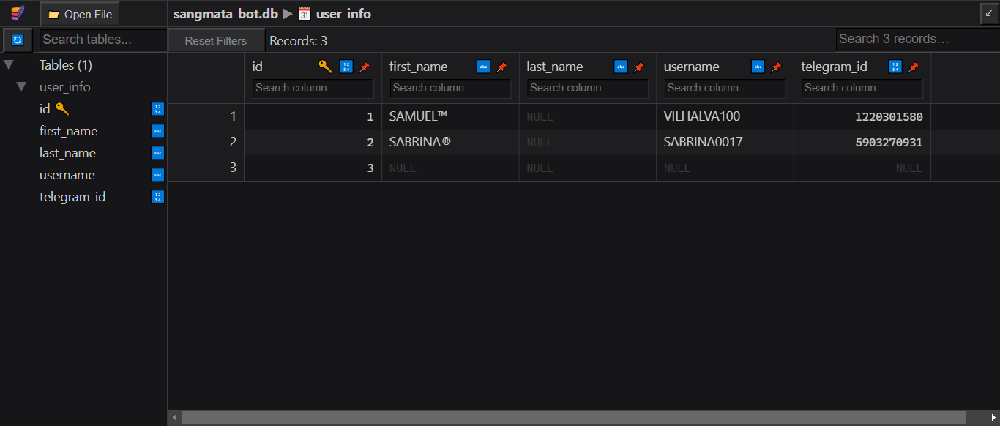

# SANGMATA BASICO
🤤ESTE BOT DO TELEGRAM TEM COMO OBJETIVO FORNECER INFORMAÇÕES SOBRE CONTAS DE USUÁRIOS DO TELEGRAM COM BASE NO ID FORNECIDO PELO USUÁRIO!

 <br>
 <br>

## DESCRIÇÃO:
Este bot Telegram tem como objetivo fornecer informações sobre contas de usuários do Telegram com base no ID fornecido pelo usuário. Aqui estão as funcionalidades:

1. **Receber ID de Usuário:**
   - Quando um usuário envia o comando `/start`, o bot responde com uma mensagem de boas-vindas instruindo o usuário a enviar o ID de um usuário do Telegram para obter informações sobre a conta daquele usuário.

2. **Obter Informações da Conta:**
   - Quando um ID de usuário válido (positivo) é enviado para o bot, ele usa a API do Telethon para obter informações detalhadas sobre a conta associada a esse ID.
   - As informações incluem o primeiro nome, sobrenome (se disponível), username e ID do usuário.
   - Essas informações são então armazenadas em um banco de dados SQLite local para referência futura.

3. **Validação de Entrada:**
   - O bot verifica se o ID fornecido é positivo antes de tentar obter informações da conta. IDs negativos são usados para chats e não são válidos para este propósito.

## EXECUTANDO O PROJETO:
1. **Colocando suas Credenciais**:
   - Para usar o `Telethon`, (Que se conecta diretamente a API do Telegram), é necessário autorizar o cliente com suas credenciais. Siga as instruções fornecidas pelo Telegram em [Obtendo api_id e api_hash](https://core.telegram.org/api/obtaining_api_id). As credenciais são compostas por duas partes: `api_id` e `api_hash`. [SAIBA MAIS.](https://docs.telethon.dev/en/stable/basic/signing-in.html)
   - Você também precisará do token do seu bot, que pode ser obtido através do [@BotFather](https://t.me/BotFather).  
   - No arquivo `./CODIGO/DADOS.py`, substitua os placeholders `api_id`, `api_hash` e `bot_token` pelas suas credenciais reais.

2. **Instalando as dependências:**
   - Antes de executar o bot, certifique-se de instalar todas as dependências necessárias. No terminal, execute o seguinte comando para instalar as dependências listadas no arquivo `requirements.txt` em `CODIGO`:
   ```bash
   pip install -r requirements.txt
   ```

3. **Inicie o Bot:**
   - Execute o bot do Telegram iniciando-o com o seguinte comando:
    ```bash
    python CODIGO.py
    ```

4. **Interagindo com o Bot**:
   1. **Inicialização:**
      - Inicie o bot enviando o comando `/start`.
      - O bot responderá com instruções para enviar o ID de um usuário.

   2. **Enviar ID de Usuário:**
      - Envie um número positivo (ID de usuário) para o bot.
      - O bot verificará se o ID é válido e recuperará as informações da conta associada.

   3. **Receber Informações:**
      - Após enviar o ID válido, o bot responderá com as informações da conta do usuário, incluindo nome, sobrenome (se disponível), username e ID.

   4. **Armazenamento de Dados:**
      - Todas as informações recuperadas são armazenadas automaticamente em um banco de dados SQLite local (`sangmata_bot.db`).
      - Isso permite que você consulte as informações posteriormente sem precisar solicitar ao bot novamente.

## NÃO SABE?
- Entendemos que para manipular arquivos em muitas linguagens e tecnologias relacionadas, é necessário possuir conhecimento nessas áreas. Para auxiliar nesse aprendizado, oferecemos alguns subsidios:
* [VEJA A DOCUMENTAÇÃO](https://docs.telethon.dev/en/stable/)
* [CURSO SUGERIDO: PYROGRAM](https://github.com/VILHALVA/CURSO-DE-PYROGRAM)
* [CURSO SUGERIDO: TELEBOT](https://github.com/VILHALVA/CURSO-DE-TELEBOT)
* [CURSO DE PYTHON](https://github.com/VILHALVA/CURSO-DE-PYTHON)
* [CURSO DE SQLITE](https://github.com/VILHALVA/CURSO-DE-SQLITE)
* [CURSO DE PYTHON COM SQLITE](https://github.com/VILHALVA/CURSO-DE-PYTHON-COM-SQLITE)
* [CONFIRA MAIS CURSOS](https://github.com/VILHALVA?tab=repositories&q=+topic:CURSO)

## CREDITOS:
- [PROJETO BASEADO NO "INFO PRIVADO COM SQLITE"](https://github.com/VILHALVA/INFO-PRIVADO-COM-SQLITE)
- [PROJETO FEITO PELO VILHALVA](https://github.com/VILHALVA)

